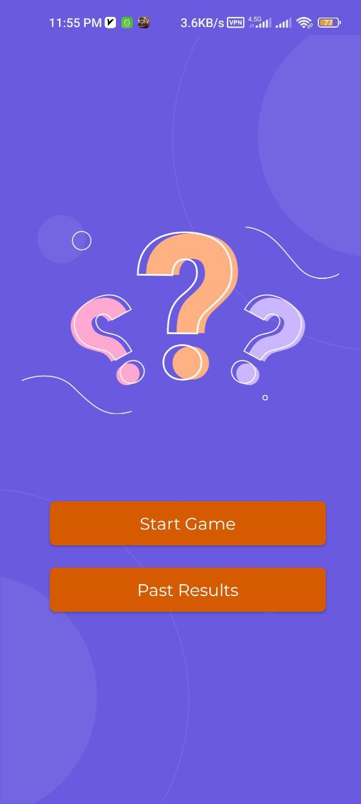
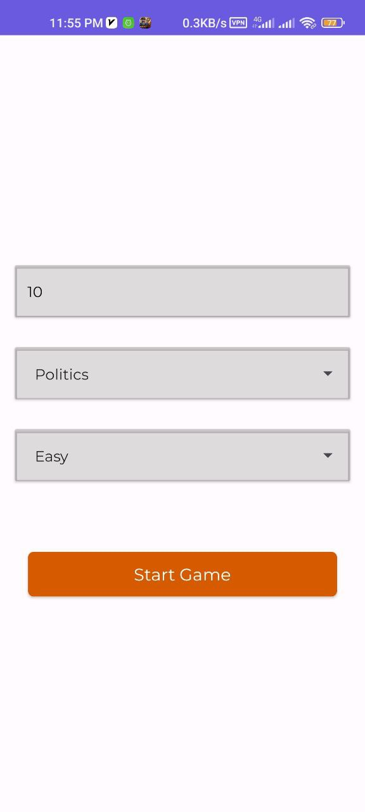
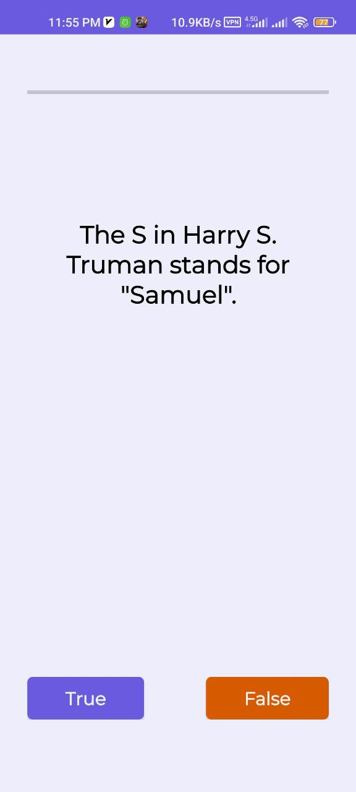
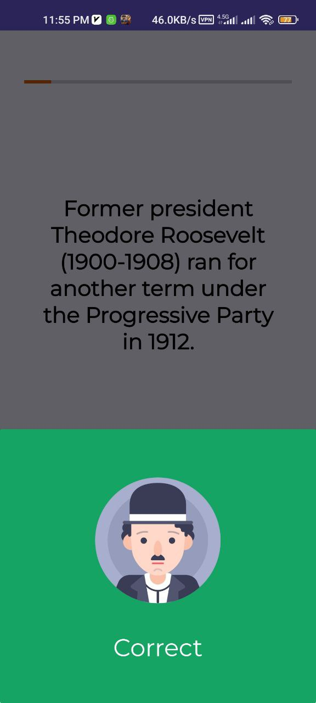
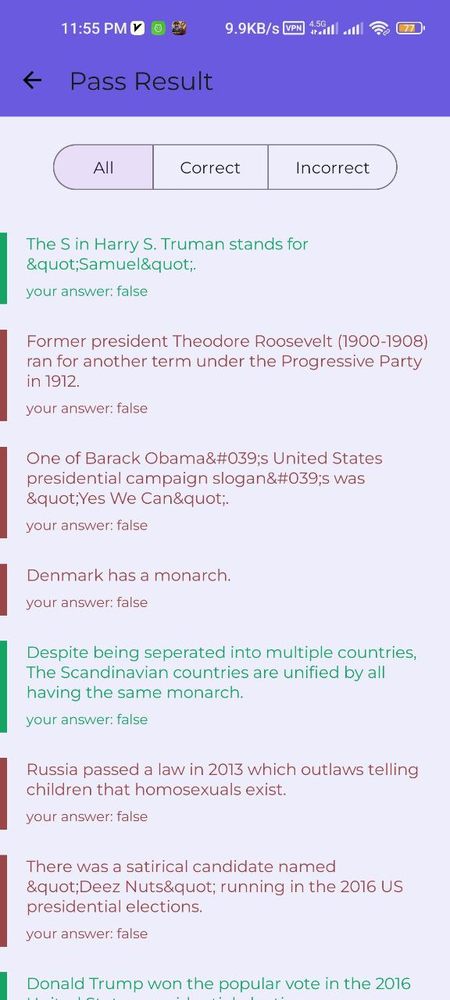
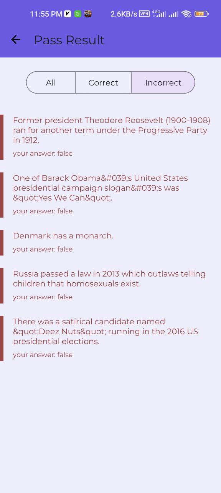

# True-or-False
Welcome to True of False, a dynamic and interactive quiz app designed to challenge and entertain users of all levels! Written in Kotlin, this app offers a customizable quiz experience, allowing users to select the number of questions, categorize their quiz, and adjust the difficulty level to suit their preferences.

## Screenshots:

- **Screenshot 1**:

  

- **Screenshot 2**:

  

- **Screenshot 3**:

  

- **Screenshot 4**:

  

- **Screenshot 5**:

  

- **Screenshot 6**:

  

- **Screenshot 7**:

  

- **Screenshot 8**:

  
